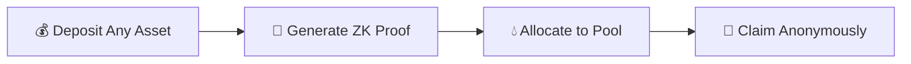
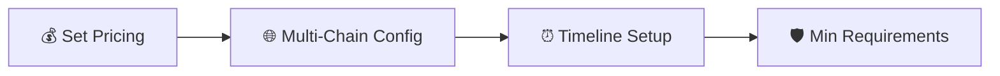

<div align="center">

# 🚀 Zaunchpad

**Cypher Capital Markets**

*The first privacy-first launchpad. Pay with any token, settle in Zcash Shielded Pools, and claim anonymously on Solana or LayerZero.*

[](https://zaunchpad.com)
[](https://docs.zaunchpad.com)
[](https://github.com/zaunchpad/zaunch)
[](https://x.com/zaunchpad)

---

</div>

## 🔧 What Zaunchpad Fixes

> **Problems with traditional token launches that put your privacy and strategy at risk.**

<div align="center">

| ❌ Problem | ✅ Solution |
|:----------:|:----------:|
| **Alpha Leaks** | **Shielded Transactions** |
| **Whale Watchers** | **Privacy Protection** |
| **Liquidity Silos** | **Cross-Chain Liquidity** |
| **Bridge Trap** | **Flexible Claims** |

</div>

### 1️⃣ Alpha Leaks 🔍
> **Early investors get exposed.**  
> Blockchain transparency reveals early investment positions to competitors and copycats.

### 2️⃣ The Whale Watchers 🐋
> **Privacy concerns for big players.**  
> Major investors don't want their early alpha strategies and positions publicly visible.

### 3️⃣ Liquidity Silos 💧
> **Cross-chain liquidity barriers.**  
> Traditional token launchpads can't pool liquidity from multiple blockchain networks.

### 4️⃣ The Bridge Trap 🌉
> **Limited claim flexibility.**  
> Token launches force you to claim on their native chain, restricting your options.

---

## ✨ What YOU GET

<div align="center">

### 🛡️ **Zcash Unified Shielded Pool** 🛡️

*Mathematically sever the link between capital origin and token destination*

</div>

<div align="center">

| Feature | Description |
|:------:|:-----------|
| 💰 **Pay in Any Token** | Flexible payment options across multiple blockchains |
| 🛡️ **Shielded Settlement** | Complete privacy protection from blockchain surveillance |
| 🎫 **ZK Proof Tickets** | Zero-knowledge proof tickets for anonymous claiming |

</div>

### 💰 1️⃣ Pay in Any Token
```
✨ Flexible payment options across multiple blockchains and assets
📦 Contribute using ETH, USDC, NEAR, or other supported tokens
🌐 From any chain - no restrictions
```

### 🛡️ 2️⃣ The Shielded Settlement
```
🔒 All transactions protected by Zcash's privacy-preserving technology
👻 Your contributions are completely shielded
🚫 No public blockchain surveillance
```

### 🎫 3️⃣ Claim via ZK Proof Tickets
```
🔐 Claim tokens on Solana using zero-knowledge proof tickets
🔗 No on-chain link between funding source and claim destination
🌍 Bridge via omni token to Layer Zero OFT supported chains
```

---

## 🛠️ Technology Stack

<div align="center">

**Built on unstoppable private cross-chain infrastructure**

</div>

<table>
<tr>
<td align="center" width="33%">

### 🔐 Zcash
**Shielded Pool Settlement**

[](https://z.cash)

Settles into shielded pools and price in Zcash

</td>
<td align="center" width="33%">

### 🌉 NEAR Intents
**Cross-Chain Swaps**

[](https://near-intents.org)

Cross-chain swaps to deposits in any chains and from Zcash shielded pools to Solana

</td>
<td align="center" width="33%">

### ⚡ Solana
**Liquidity Layer**

[](https://solana.com)

Liquidity layer, tokens originally minted using launchpads like Meteora

</td>
</tr>
<tr>
<td align="center" width="33%">

### 🔒 Phala Network
**TEE Verification**

[](https://phala.com)

TEE for verifying NEAR Intents ZCash cross-chain transactions and generating zkSNARK proofs

</td>
<td align="center" width="33%">

### ⚙️ Circom
**zkSNARK Proofs**

[](https://github.com/iden3/circom)

For generating zkSNARK proofs for verifying NEAR Intents based ZCash cross chain transactions

</td>
<td align="center" width="33%">

### 🚁 TukTuk by Helium
**Solana Automation**

[](https://tuktuk.fun)

Solana automation framework for taking Solana liquidity and putting into Meteora contracts

</td>
</tr>
</table>

---

## 🎯 Two Powerful Workflows

<div align="center">

### 🛒 Buying Tokens | 🎨 Creating Launches

</div>

---

### 🛒 Buying Tokens Privately

<div align="center">



</div>

#### 1️⃣ 💰 Deposit with Any Asset
> Using **NEAR Intents**, the system automatically swaps your deposit to Zcash based on ticket amount.
> 
> **Supported Assets:** ETH, USDC, NEAR, and more

#### 2️⃣ 🔐 ZK-SNARK Proof Generation
> Generates a **zero-knowledge proof** that acts as an IOU of predetermined amount at the mint price.
> 
> **This proof is your claim ticket** 🎫

#### 3️⃣ 💧 Capital Allocation
> Allocated capital is deposited into the **Meteora pool**, providing liquidity for the token launch while maintaining your privacy.

#### 4️⃣ 🎫 Flexible Claiming
> With the claim system via proofs, you can either:
> - ✅ Claim on **Solana**
> - ✅ Bridge via **omni token** to claim on your desired **Layer Zero OFT** supported chain

---

### 🎨 Create Token Launch

<div align="center">



</div>

#### 1️⃣ 💰 Set Pricing
> Outline price and number of tokens per Zcash.
> 
> **Define your token economics and allocation strategy.**

#### 2️⃣ 🌐 Multi-chain Configuration
> Choose whether to enable **Layer Zero** for multichain claims.
> 
> **Select which supported chains** your token can be claimed on.

#### 3️⃣ ⏰ Timeline Setup
> Define how long the token sale runs, when it starts, and when the claim period begins.
> 
> **Set specific dates and durations.**

#### 4️⃣ 🛡️ Minimum Requirements
> Set minimum thresholds for successful token launch and claim eligibility.
> 
> **Protect both you and your investors.**

---

<div align="center">

---

### 🌟 Built with ❤️ by **Cypher Capital Markets** 🌟


**🚀 Launch your token with complete privacy and cross-chain flexibility 🚀**

---

</div>
